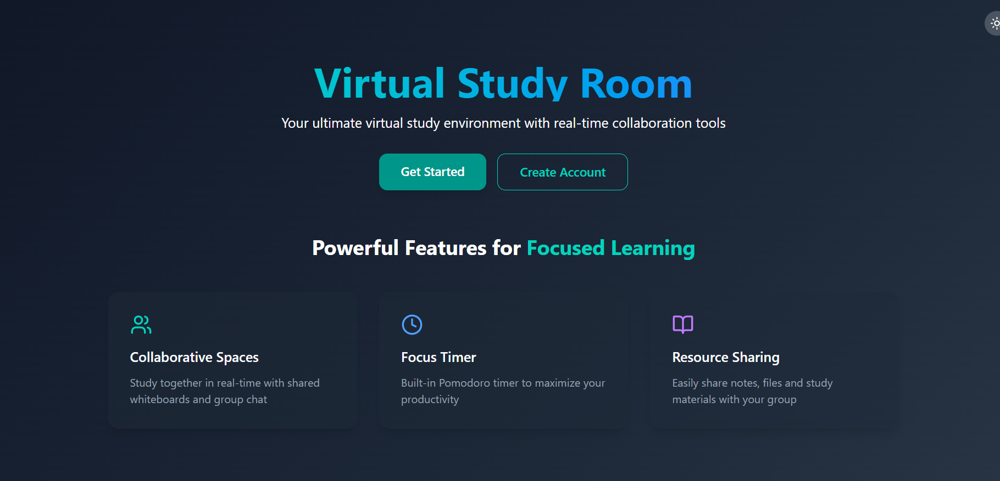
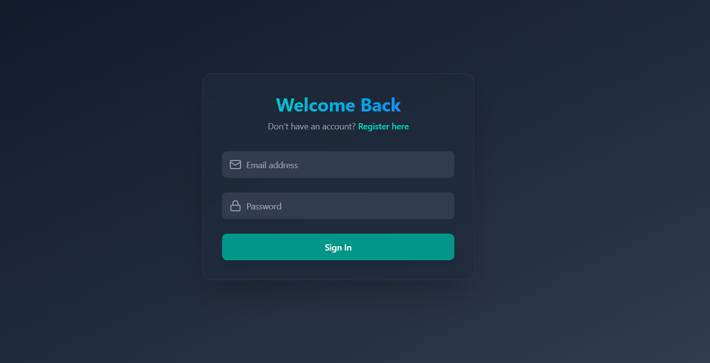
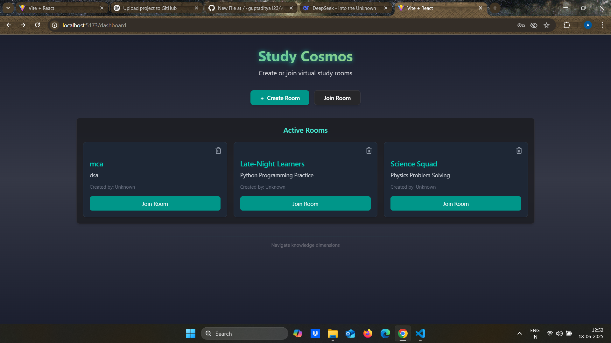
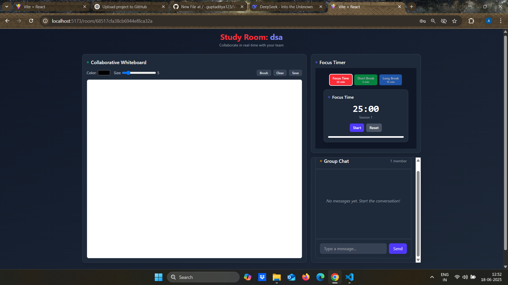

# 🎓 Virtual Study Room

A real-time collaborative MERN application designed for focused study sessions. Users can create or join rooms, use a Pomodoro timer, chat, and draw on a shared canvas — all in one place.

---

## ✨ Features

- 👤 User Authentication (Register/Login)
- 🏠 Landing Page & Dashboard
- 🚪 Create and Join Study Rooms
- ⏱️ Pomodoro Timer in Each Room
- 💬 Real-time Chat via Socket.IO
- 🎨 Collaborative Canvas Drawing
- 📱 Fully Responsive UI with Tailwind CSS

---

## 🖼️ Screenshots

> All screenshots are located inside the `/assets` folder.

| Landing Page | Login | Register |
|--------------|-------|----------|
|  |  |  |

| Dashboard |  Room View |
|-----------|-----------|
|   |  |

---

## 🛠️ Tech Stack

- **Frontend:** React, Tailwind CSS
- **Backend:** Node.js, Express.js
- **Database:** MongoDB
- **Real-time:** Socket.IO
- **Others:** JWT for authentication, bcrypt for password hashing

---

## 🙏 Acknowledgements

This project was built independently for learning and portfolio purposes.  
Wherever I got stuck (logic, CSS, optimization), I took assistance from **AI tools like ChatGPT** and open-source documentation to understand and resolve issues effectively.

---

